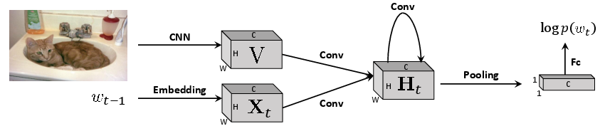
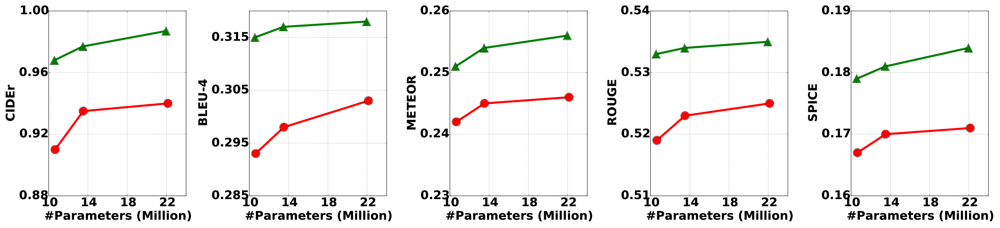
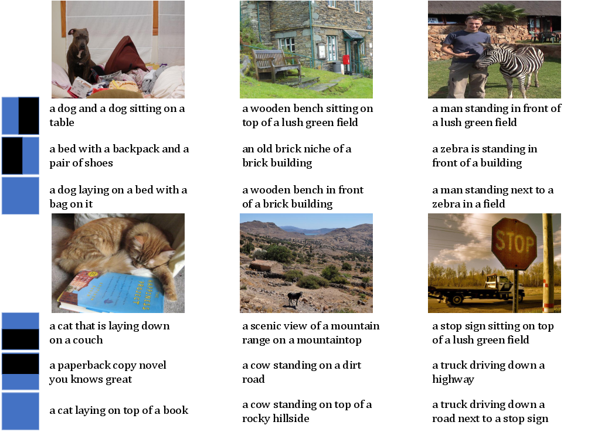
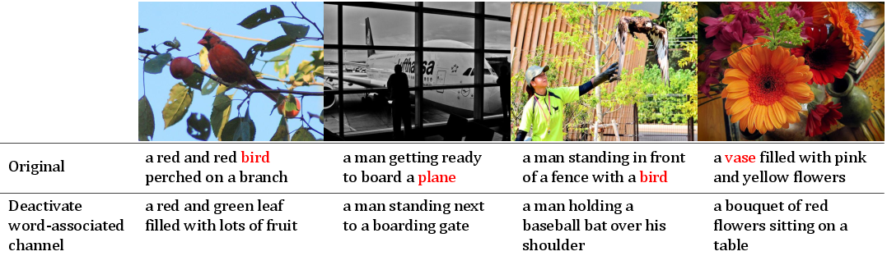
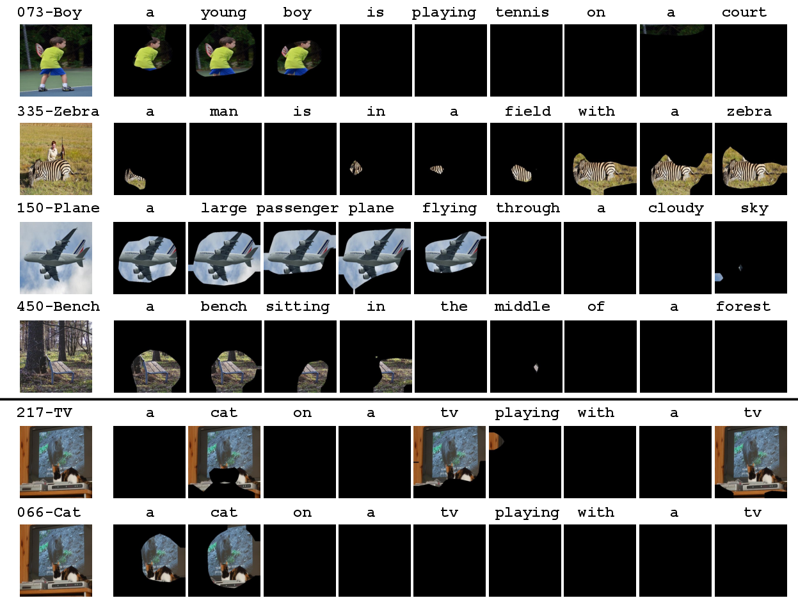
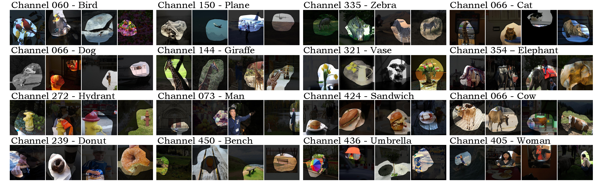

# Code of [Rethinking the Form of Latent States in Image Captioning](https://arxiv.org/abs/1807.09958)

## Overview



## Summarization

- We empirically found representing latent states as 2D maps is better than 1D vectors, both quantitatively and qualitatively,
due to the spatial locality preserved in the latent states.

- Quantitatively, with similar numbers of parameters, RNN-2DS (i.e. 2D states without gate functions) already outperforms LSTM-1DS (i.e. 1D states with LSTM cells).



- Qualitatively, spatial locality leads to visual interpretation and manipulation of the decoding process.

	- Manipulation on the spatial grids
	
	
 
	- Manipulation on the channels

	

	- Interpretation on the internal dynamics

	

	- Interpretation on the word-channel associations

	

## Citation

```
@inproceedings{dai2018rethinking,
  title={Rethinking the Form of Latent States in Image Captioning},
  author={Dai, Bo and Ye, Deming and Lin, Dahua},
  booktitle={ECCV},
  year={2018}
}
```


	 
